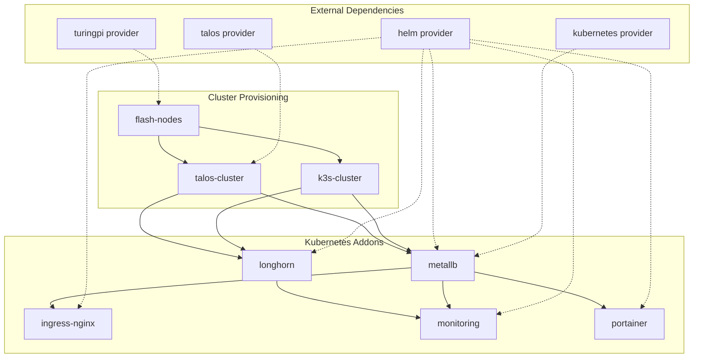
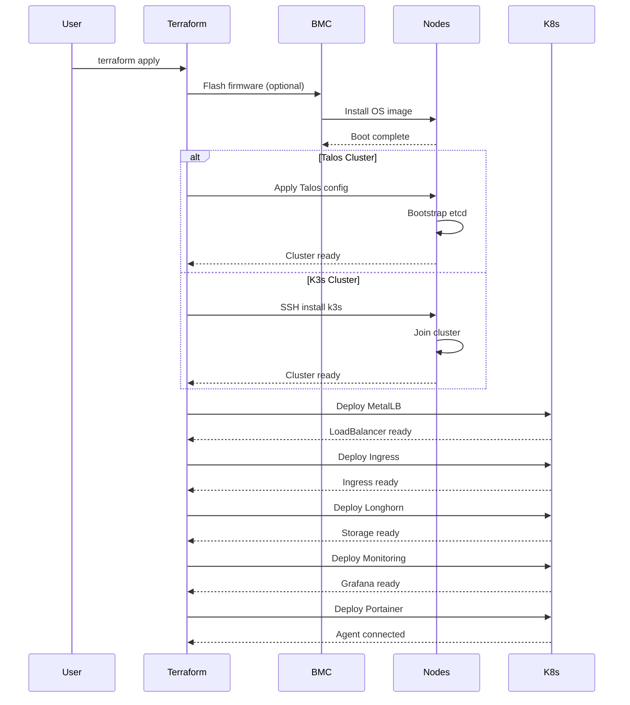
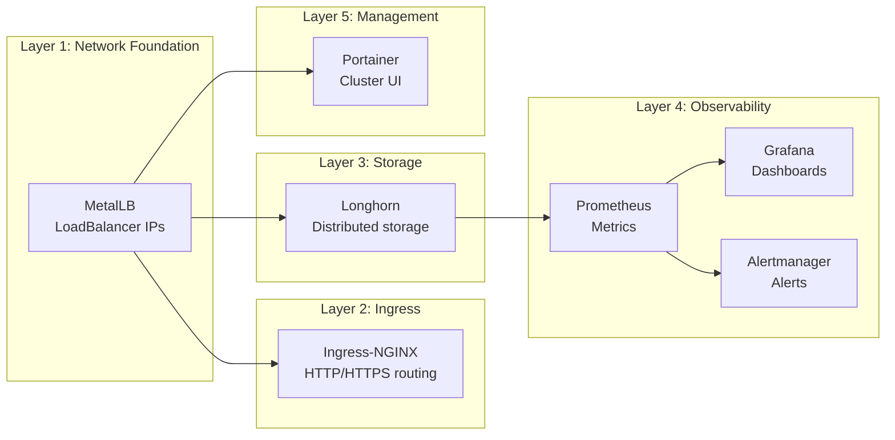

# Architecture

This document describes the architecture and module composition of the Terraform Turing Pi Modules.

## Module Dependency Diagram



## Deployment Flow



## Addon Composition



## Module Structure

```
terraform-turingpi-modules/
├── modules/
│   ├── flash-nodes/        # Firmware flashing via BMC API
│   ├── talos-cluster/      # Talos Linux Kubernetes
│   ├── k3s-cluster/        # K3s on Armbian
│   └── addons/
│       ├── metallb/        # Layer 2/BGP load balancer
│       ├── ingress-nginx/  # Ingress controller
│       ├── longhorn/       # Distributed block storage
│       ├── monitoring/     # Prometheus/Grafana stack
│       └── portainer/      # Cluster management UI
├── examples/
│   ├── talos-full-stack/   # Complete Talos deployment
│   └── k3s-full-stack/     # Complete K3s deployment
└── test/
    └── provider-test/      # Provider data source tests
```

## Provider Dependencies

| Module | Required Providers |
|--------|-------------------|
| flash-nodes | `jfreed-dev/turingpi` |
| talos-cluster | `siderolabs/talos`, `hashicorp/kubernetes` |
| k3s-cluster | `hashicorp/null` (SSH provisioner) |
| metallb | `hashicorp/helm`, `hashicorp/kubernetes` |
| ingress-nginx | `hashicorp/helm` |
| longhorn | `hashicorp/helm` |
| monitoring | `hashicorp/helm` |
| portainer | `hashicorp/helm` |

## Recommended Deployment Order

1. **flash-nodes** (optional) - Flash firmware to compute modules
2. **talos-cluster** or **k3s-cluster** - Bootstrap Kubernetes
3. **metallb** - Enable LoadBalancer service type
4. **ingress-nginx** - HTTP/HTTPS ingress (requires MetalLB)
5. **longhorn** - Persistent storage (can deploy in parallel with ingress)
6. **monitoring** - Observability stack (requires storage)
7. **portainer** - Management UI (requires MetalLB)

## Design Principles

- **Modularity**: Each addon is independently deployable
- **Composability**: Modules declare explicit dependencies via `depends_on`
- **Flexibility**: All modules support customization via variables
- **Idempotency**: Safe to re-apply without side effects
- **Documentation**: Auto-generated docs via terraform-docs
