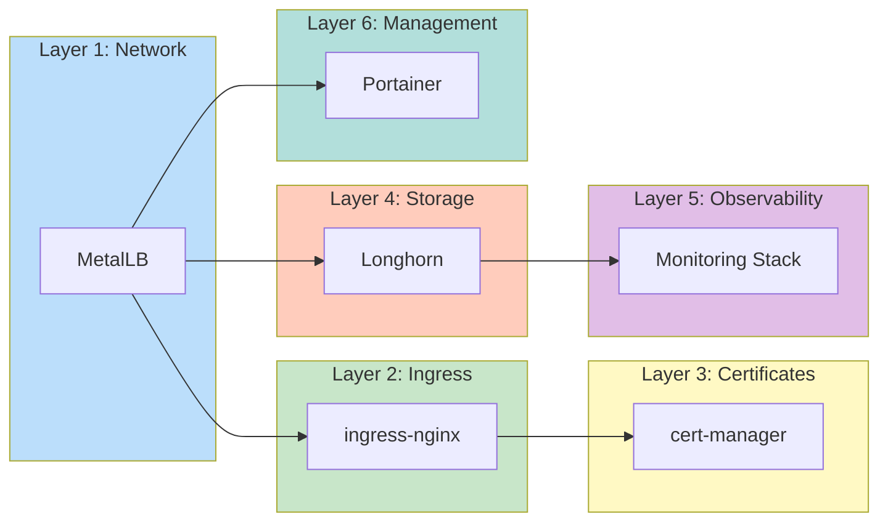
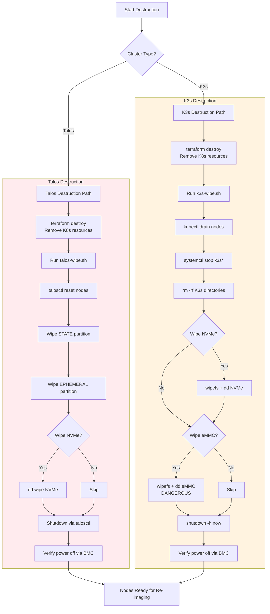

# Cluster Lifecycle Workflows

This document describes the complete lifecycle workflows for Talos and K3s clusters on Turing Pi hardware, including imaging, deployment, module installation, and destruction.

## Table of Contents

- [Talos Cluster Workflow](#talos-cluster-workflow)
- [K3s Cluster Workflow](#k3s-cluster-workflow)
- [Addon Module Deployment](#addon-module-deployment)
- [Cluster Destruction](#cluster-destruction)
- [Quick Reference](#quick-reference)

---

## Talos Cluster Workflow

### Talos Lifecycle Flowchart

```mermaid
flowchart TD
    subgraph Phase1["Phase 1: Image Preparation"]
        A[Start] --> B{Custom Extensions<br/>Required?}
        B -->|Yes| C[Use talos-image module]
        B -->|No| D[Download stock Talos image]
        C --> E[Generate schematic ID]
        E --> F[Build image URL]
        F --> G[Download .raw.xz image]
        D --> G
        G --> H[Decompress image]
    end

    subgraph Phase2["Phase 2: Node Imaging"]
        H --> I[Power off nodes via BMC]
        I --> J[Flash image to nodes<br/>flash-nodes module]
        J --> K[Power on nodes]
        K --> L[Wait for boot<br/>~120 seconds]
    end

    subgraph Phase3["Phase 3: Cluster Bootstrap"]
        L --> M[Generate machine secrets]
        M --> N[Generate machine configs<br/>CP + Workers]
        N --> O[Apply config to<br/>control plane nodes]
        O --> P[Apply config to<br/>worker nodes]
        P --> Q[Bootstrap first<br/>control plane]
        Q --> R[Wait for cluster ready]
        R --> S[Export kubeconfig<br/>+ talosconfig]
    end

    subgraph Phase4["Phase 4: Addon Deployment"]
        S --> T[Deploy MetalLB]
        T --> U[Deploy ingress-nginx]
        U --> V[Deploy cert-manager]
        V --> W[Deploy Longhorn]
        W --> X[Deploy monitoring]
        X --> Y[Deploy Portainer]
        Y --> Z[Cluster Ready]
    end

    subgraph Destroy["Destruction Path"]
        Z -.->|Destroy| AA[terraform destroy]
        AA --> AB[Run talos-wipe.sh]
        AB --> AC[Wipe STATE partition]
        AC --> AD[Wipe EPHEMERAL partition]
        AD --> AE{Wipe NVMe?}
        AE -->|Yes| AF[Wipe NVMe drives]
        AE -->|No| AG[Shutdown nodes]
        AF --> AG
        AG --> AH[Verify power off<br/>via BMC]
        AH --> AI[Nodes Ready for<br/>Re-imaging]
    end

    style Phase1 fill:#e1f5fe
    style Phase2 fill:#fff3e0
    style Phase3 fill:#e8f5e9
    style Phase4 fill:#f3e5f5
    style Destroy fill:#ffebee
```



### Talos Deployment Steps

#### Step 1: Prepare Custom Image (if needed)

For Longhorn storage support, you MUST use a custom Talos image with iSCSI extensions:

```hcl
# modules/talos-image usage
module "talos_image" {
  source = "jfreed-dev/modules/turingpi//modules/talos-image"

  talos_version = "v1.9.2"
  architecture  = "arm64"
  preset        = "longhorn"  # Includes iscsi-tools + util-linux-tools
}

output "download_command" {
  value = module.talos_image.download_command
}
```

Then download:
```bash
curl -L "https://factory.talos.dev/image/613e1592.../v1.9.2/metal-arm64.raw.xz" \
  | xz -d > talos-longhorn-arm64.raw
```

**Pre-built Schematic IDs:**

| Preset | Extensions | Schematic ID |
|--------|------------|--------------|
| `longhorn` | iscsi-tools, util-linux-tools | `613e1592b2da41ae5e265e8789429f22e121aab91cb4deb6bc3c0b6262961245` |
| `longhorn-nfs` | Above + nfs-utils | Generate via module |
| `full` | All common extensions | Generate via module |

#### Step 2: Flash Nodes

```hcl
module "flash" {
  source = "jfreed-dev/modules/turingpi//modules/flash-nodes"

  nodes = {
    1 = { firmware = "./talos-longhorn-arm64.raw" }
    2 = { firmware = "./talos-longhorn-arm64.raw" }
    3 = { firmware = "./talos-longhorn-arm64.raw" }
    4 = { firmware = "./talos-longhorn-arm64.raw" }
  }

  power_on_after_flash = true
}

resource "time_sleep" "wait_for_boot" {
  depends_on      = [module.flash]
  create_duration = "120s"
}
```

#### Step 3: Deploy Cluster

```hcl
module "talos_cluster" {
  source     = "jfreed-dev/modules/turingpi//modules/talos-cluster"
  depends_on = [time_sleep.wait_for_boot]

  cluster_name     = "turing-cluster"
  cluster_endpoint = "https://10.10.88.73:6443"

  control_plane = [
    { host = "10.10.88.73", hostname = "turing-cp1" }
  ]

  workers = [
    { host = "10.10.88.74", hostname = "turing-w1" },
    { host = "10.10.88.75", hostname = "turing-w2" },
    { host = "10.10.88.76", hostname = "turing-w3" }
  ]

  # NVMe for Longhorn
  nvme_storage_enabled = true
  nvme_device          = "/dev/nvme0n1"
  nvme_mountpoint      = "/var/mnt/longhorn"
  nvme_control_plane   = true

  kubeconfig_path  = "./kubeconfig"
  talosconfig_path = "./talosconfig"
}
```

#### Step 4: Deploy Addons

See [Addon Module Deployment](#addon-module-deployment) section.

---

## K3s Cluster Workflow

### K3s Lifecycle Flowchart

```mermaid
flowchart TD
    subgraph Phase1["Phase 1: Image Preparation"]
        A[Start] --> B[Download Armbian image<br/>from trusted source]
        B --> C[Decompress .img.xz]
        C --> D[Image ready for flashing]
    end

    subgraph Phase2["Phase 2: Node Imaging"]
        D --> E[Power off nodes via BMC]
        E --> F[Flash Armbian to nodes<br/>flash-nodes module]
        F --> G[Power on nodes]
        G --> H[Wait for boot<br/>~90 seconds]
        H --> I[Configure SSH keys<br/>+ hostnames]
    end

    subgraph Phase3["Phase 3: Cluster Bootstrap"]
        I --> J[Install prerequisites<br/>open-iscsi, nfs-common]
        J --> K{NVMe Storage?}
        K -->|Yes| L[Partition & mount NVMe]
        K -->|No| M[Continue]
        L --> M
        M --> N[Install K3s server<br/>on control plane]
        N --> O[Generate cluster token]
        O --> P[Install K3s agent<br/>on workers]
        P --> Q[Wait for nodes ready]
        Q --> R[Export kubeconfig]
    end

    subgraph Phase4["Phase 4: Addon Deployment"]
        R --> S[Deploy MetalLB]
        S --> T[Deploy ingress-nginx]
        T --> U[Deploy cert-manager]
        U --> V[Deploy Longhorn]
        V --> W[Deploy monitoring<br/>reduced storage]
        W --> X[Deploy Portainer]
        X --> Y[Cluster Ready]
    end

    subgraph Destroy["Destruction Path"]
        Y -.->|Destroy| AA[terraform destroy]
        AA --> AB[Run k3s-wipe.sh]
        AB --> AC[Drain nodes from cluster]
        AC --> AD[Stop K3s services]
        AD --> AE[Wipe K3s directories]
        AE --> AF{Wipe NVMe?}
        AF -->|Yes| AG[Wipe NVMe drives]
        AF -->|No| AH{Wipe eMMC?}
        AG --> AH
        AH -->|Yes| AI[Wipe eMMC<br/>DANGEROUS]
        AH -->|No| AJ[Shutdown nodes]
        AI --> AJ
        AJ --> AK[Verify power off<br/>via BMC]
        AK --> AL[Nodes Ready for<br/>Re-imaging]
    end

    style Phase1 fill:#e1f5fe
    style Phase2 fill:#fff3e0
    style Phase3 fill:#e8f5e9
    style Phase4 fill:#f3e5f5
    style Destroy fill:#ffebee
```



### K3s Prerequisites

#### Network Planning: Static IP Addresses

Kubernetes nodes require stable IP addresses. We recommend using **DHCP reservations** (static DHCP) to assign consistent IPs to each node based on MAC address.

**Recommended Approach: DHCP Reservations**

Configure your network's DHCP server to assign fixed IPs to each node's MAC address. Check your:
- Home router admin interface
- Dedicated DHCP server (pfSense, OPNsense, Pi-hole, etc.)
- Enterprise DHCP server

This approach allows nodes to boot normally while always receiving the same IP.

**Alternative: Static IP via Autoconfig**

If DHCP reservations aren't available, configure static IPs using Armbian's first-run script. Add to `/boot/armbian_first_run.txt`:

```bash
# Static IP configuration (adjust for your network)
FR_net_change_defaults=0
FR_net_static_enabled=1
FR_net_static_ip="10.10.88.74"
FR_net_static_gateway="10.10.88.1"
FR_net_static_netmask="255.255.255.0"
FR_net_static_dns="10.10.88.1"
```

Or configure manually after first boot via `/etc/network/interfaces` or netplan.

**Example IP Plan:**

| Node | Hostname | IP Address | Role |
|------|----------|------------|------|
| 1 | turing-cp1 | 10.10.88.73 | Control Plane |
| 2 | turing-w1 | 10.10.88.74 | Worker |
| 3 | turing-w2 | 10.10.88.75 | Worker |
| 4 | turing-w3 | 10.10.88.76 | Worker |

### K3s Deployment Steps

#### Step 1: Find and Download Armbian Image

Use the helper script to find the latest Armbian image for Turing RK1:

```bash
# List available images
./scripts/find-armbian-image.sh --list

# Get URL for latest minimal trixie image
./scripts/find-armbian-image.sh -v minimal -r trixie

# Or download directly
./scripts/find-armbian-image.sh -v minimal -r trixie --download
```

#### Step 2: Generate Autoconfig (Optional but Recommended)

Create an autoconfig file for automated first-boot setup:

```bash
# Generate autoconfig with password and SSH key
./scripts/find-armbian-image.sh \
    --autoconfig armbian_first_run.txt \
    --root-password "YourSecurePassword" \
    --timezone "America/Chicago" \
    --ssh-key ~/.ssh/id_ed25519.pub
```

This creates `/boot/armbian_first_run.txt` with:
- Root password preset
- Timezone configuration
- SSH public key for passwordless access

**Manual Autoconfig Format:**

```bash
# /boot/armbian_first_run.txt
FR_net_change_defaults=1
FR_general_delete_firstrun_file_after_completion=1

PRESET_ROOT_PASSWORD="YourSecurePassword"
PRESET_USER_NAME=""
PRESET_LOCALE="en_US.UTF-8"
PRESET_TIMEZONE="America/Chicago"
```

See [Armbian Autoconfig Documentation](https://docs.armbian.com/User-Guide_Autoconfig/)

#### Step 3: Flash Nodes via BMC

**Option A: Direct URL Flash (Recommended)**

Flash directly from GitHub URL without downloading:

```bash
ARMBIAN_URL="https://github.com/armbian/community/releases/download/26.2.0-trunk.151/Armbian_community_26.2.0-trunk.151_Turing-rk1_trixie_vendor_6.1.115_minimal.img.xz"

# Flash each node (BMC API uses 0-3 for nodes 1-4)
for node in 1 2 3 0; do
    curl -sk -u root:turing "https://BMC_IP/api/bmc?opt=set&type=flash&node=${node}&file=${ARMBIAN_URL}"
    # Wait for flash to complete before next node
    while curl -sk -u root:turing "https://BMC_IP/api/bmc?opt=get&type=flash" | grep -q "Transferring"; do
        sleep 30
    done
done
```

**Option B: Terraform Module**

```hcl
module "flash" {
  source = "jfreed-dev/modules/turingpi//modules/flash-nodes"

  nodes = {
    1 = { firmware = "./Armbian_trixie.img" }
    2 = { firmware = "./Armbian_trixie.img" }
    3 = { firmware = "./Armbian_trixie.img" }
    4 = { firmware = "./Armbian_trixie.img" }
  }

  power_on_after_flash = true
}
```

#### Step 4: Configure Nodes (If Not Using Autoconfig)

After first boot with default credentials (root/1234):

```bash
SSH_KEY="~/.ssh/id_ed25519"
NEW_PASSWORD="YourSecurePassword"

declare -A NODES
NODES["10.10.88.73"]="turing-cp1"
NODES["10.10.88.74"]="turing-w1"
NODES["10.10.88.75"]="turing-w2"
NODES["10.10.88.76"]="turing-w3"

for ip in "${!NODES[@]}"; do
    hostname="${NODES[$ip]}"
    sshpass -p "1234" ssh -o StrictHostKeyChecking=no root@$ip bash <<REMOTE
# Change password
echo "root:${NEW_PASSWORD}" | chpasswd

# Set hostname
hostnamectl set-hostname ${hostname}

# Add SSH key
mkdir -p ~/.ssh && chmod 700 ~/.ssh
echo "$(cat ${SSH_KEY}.pub)" >> ~/.ssh/authorized_keys
chmod 600 ~/.ssh/authorized_keys
REMOTE
done
```

#### Step 5: Install K3s Prerequisites

Each node needs iSCSI support for Longhorn:

```bash
for node in 10.10.88.73 10.10.88.74 10.10.88.75 10.10.88.76; do
    ssh -i $SSH_KEY root@$node "apt-get update && apt-get install -y open-iscsi nfs-common && systemctl enable iscsid && systemctl start iscsid"
done
```

#### Step 6: Deploy Cluster

```hcl
module "k3s_cluster" {
  source = "jfreed-dev/modules/turingpi//modules/k3s-cluster"

  cluster_name = "k3s-cluster"

  control_plane = {
    host     = "10.10.88.73"
    ssh_user = "root"
    ssh_key  = file("~/.ssh/id_ed25519")
    hostname = "turing-cp1"
  }

  workers = [
    {
      host     = "10.10.88.74"
      ssh_user = "root"
      ssh_key  = file("~/.ssh/id_ed25519")
      hostname = "turing-w1"
    },
    {
      host     = "10.10.88.75"
      ssh_user = "root"
      ssh_key  = file("~/.ssh/id_ed25519")
      hostname = "turing-w2"
    },
    {
      host     = "10.10.88.76"
      ssh_user = "root"
      ssh_key  = file("~/.ssh/id_ed25519")
      hostname = "turing-w3"
    }
  ]

  k3s_version = "v1.31.4+k3s1"

  # NVMe for Longhorn
  nvme_storage_enabled = true
  nvme_device          = "/dev/nvme0n1"
  nvme_mountpoint      = "/var/lib/longhorn"
  nvme_control_plane   = true

  # Disable built-ins (use our addons instead)
  disable_traefik       = true
  disable_servicelb     = true
  disable_local_storage = true

  # Longhorn prerequisites (auto-installed)
  install_open_iscsi = true
  install_nfs_common = true

  kubeconfig_path = "./kubeconfig"
}
```

#### Step 7: Deploy Addons

See [Addon Module Deployment](#addon-module-deployment) section.

---

## Addon Module Deployment

### Deployment Order Flowchart



### Platform-Specific Configuration

| Module | Talos Linux | K3s (Armbian) |
|--------|-------------|---------------|
| `privileged_namespace` | `true` (PSA enforced) | `false` (PSA not enforced) |
| `talos_extensions_installed` | `true` (custom image required) | `true` (apt packages) |
| `prometheus_storage_size` | `20Gi` (default) | `10Gi` (eMMC constraint) |

### Complete Addon Configuration

```hcl
# Layer 1: Network - MetalLB
module "metallb" {
  source     = "jfreed-dev/modules/turingpi//modules/addons/metallb"
  depends_on = [module.cluster]

  ip_range             = "10.10.88.80-10.10.88.89"
  privileged_namespace = var.is_talos  # true for Talos, false for K3s
}

# Layer 2: Ingress
module "ingress_nginx" {
  source     = "jfreed-dev/modules/turingpi//modules/addons/ingress-nginx"
  depends_on = [module.metallb]

  # Optional: Fixed LoadBalancer IP
  # loadbalancer_ip = "10.10.88.80"
}

# Layer 3: Certificates
module "cert_manager" {
  source     = "jfreed-dev/modules/turingpi//modules/addons/cert-manager"
  depends_on = [module.cluster]

  create_selfsigned_issuer = true

  # Optional: Let's Encrypt
  # create_letsencrypt_issuer = true
  # letsencrypt_email         = "admin@example.com"
}

# Layer 4: Storage
module "longhorn" {
  source     = "jfreed-dev/modules/turingpi//modules/addons/longhorn"
  depends_on = [module.cluster]

  default_replica_count      = 2
  default_data_path          = var.is_talos ? "/var/mnt/longhorn" : "/var/lib/longhorn"
  talos_extensions_installed = true
  privileged_namespace       = var.is_talos
}

# Layer 5: Observability
module "monitoring" {
  source     = "jfreed-dev/modules/turingpi//modules/addons/monitoring"
  depends_on = [module.longhorn]

  grafana_admin_password  = var.grafana_password
  storage_class           = "longhorn"
  persistence_enabled     = true
  prometheus_storage_size = var.is_talos ? "20Gi" : "10Gi"
  privileged_namespace    = var.is_talos
}

# Layer 6: Management
module "portainer" {
  source     = "jfreed-dev/modules/turingpi//modules/addons/portainer"
  depends_on = [module.metallb]

  # Optional: Fixed LoadBalancer IP
  # loadbalancer_ip = "10.10.88.81"
}
```

---

## Cluster Destruction

### Destruction Flowchart



### Talos Cluster Destruction

**Option 1: Quick Destroy (Keep OS)**
```bash
# Remove Kubernetes resources only
terraform destroy

# Verify cluster is gone
talosctl --talosconfig ./talosconfig cluster show
```

**Option 2: Full Wipe (Prepare for Re-imaging)**
```bash
# Step 1: Terraform destroy (optional but recommended)
terraform destroy

# Step 2: Full disk wipe and shutdown
./scripts/talos-wipe.sh \
  --talosconfig ./talosconfig \
  --nodes "10.10.88.73,10.10.88.74,10.10.88.75,10.10.88.76" \
  --bmc 10.10.88.70 \
  --user root \
  --password "YourBMCPassword" \
  --disks "/dev/nvme0n1"

# Or with NVMe wipe disabled:
./scripts/talos-wipe.sh \
  --talosconfig ./talosconfig \
  --nodes "10.10.88.73,10.10.88.74,10.10.88.75,10.10.88.76" \
  --bmc 10.10.88.70 \
  --no-nvme
```

### K3s Cluster Destruction

**Option 1: Quick Destroy (Keep OS)**
```bash
# Remove Kubernetes resources only
terraform destroy

# Manually uninstall K3s (optional)
for node in 10.10.88.74 10.10.88.75 10.10.88.76; do
  ssh root@$node "/usr/local/bin/k3s-uninstall.sh || /usr/local/bin/k3s-agent-uninstall.sh"
done
```

**Option 2: Full Wipe (Prepare for Re-imaging)**
```bash
# Step 1: Terraform destroy (optional but recommended)
terraform destroy

# Step 2: Full wipe and shutdown
./scripts/k3s-wipe.sh \
  --kubeconfig ./kubeconfig \
  --nodes "10.10.88.74,10.10.88.75,10.10.88.76" \
  --bmc 10.10.88.70 \
  --ssh-key ~/.ssh/id_ed25519 \
  --user root \
  --password "YourBMCPassword" \
  --disks "/dev/nvme0n1"

# Full eMMC wipe (makes nodes unbootable):
./scripts/k3s-wipe.sh \
  --kubeconfig ./kubeconfig \
  --nodes "10.10.88.74,10.10.88.75,10.10.88.76" \
  --bmc 10.10.88.70 \
  --ssh-key ~/.ssh/id_ed25519 \
  --wipe-emmc
```

---

## Quick Reference

### Environment Variables

```bash
# BMC Access
export TURINGPI_ENDPOINT="https://10.10.88.70"
export TURINGPI_USERNAME="root"
export TURINGPI_PASSWORD="your-bmc-password"
export TURINGPI_INSECURE="true"

# Talos
export TALOSCONFIG="./talosconfig"

# Kubernetes
export KUBECONFIG="./kubeconfig"
```

### Common Commands

**Talos Cluster:**
```bash
# Check cluster health
talosctl --talosconfig ./talosconfig health

# Get node status
talosctl --talosconfig ./talosconfig get members

# View logs
talosctl --talosconfig ./talosconfig logs kubelet

# Upgrade Talos
talosctl --talosconfig ./talosconfig upgrade --image factory.talos.dev/...
```

**K3s Cluster:**
```bash
# Check node status
kubectl get nodes -o wide

# Check K3s service
ssh root@10.10.88.74 "systemctl status k3s"

# View K3s logs
ssh root@10.10.88.74 "journalctl -u k3s -f"

# Upgrade K3s
ssh root@10.10.88.74 "curl -sfL https://get.k3s.io | INSTALL_K3S_VERSION=v1.32.0+k3s1 sh -"
```

**Addon Verification:**
```bash
# MetalLB
kubectl get ipaddresspools -n metallb-system

# Ingress
kubectl get svc -n ingress-nginx

# Longhorn
kubectl get volumes.longhorn.io -n longhorn-system

# Monitoring
kubectl get pods -n monitoring

# Portainer
kubectl get svc -n portainer
```

### Troubleshooting

| Issue | Talos Solution | K3s Solution |
|-------|----------------|--------------|
| Node not booting | Check BMC console, verify image | Check BMC console, verify SSH |
| Cluster unreachable | `talosctl health`, check endpoint | `kubectl cluster-info`, check API |
| Longhorn failing | Verify extensions in image | `apt install open-iscsi` |
| MetalLB no IP | Check speaker pods, ARP | Check speaker pods, ARP |
| Storage PVC pending | Check Longhorn volumes | Check Longhorn volumes, disk space |

---

## Version History

| Version | Date | Changes |
|---------|------|---------|
| 1.0 | 2026-01-19 | Initial workflow documentation |
